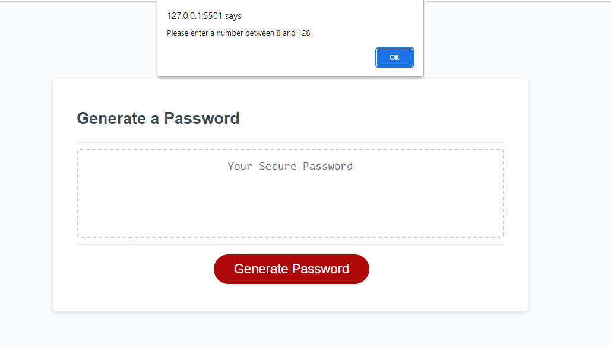

# Module-3-Challenge Random Password Generator
## Description

- Making new secure passords can be difficult but with this website you can make one with ease.
- This random password generator can create passwords within certain parameters.
- I can use this webiste to generate secure passwords for me.
- I learned how to make interactible website using JavaScript.

## Features

- Custom Password Length Number Entry (8 - 128 Character Limit)
- Upper & LowerCase, Numbers, and Special Character choices

## Installation

Live Deployment on GitHub pages. No installation needed.

Link: https://joseperez013.github.io/Module-3-Challenge/

## Usage

- Clicking the link will present you with this page.

- Once on the page click **Generate Password** and follow the prompts.

- Make sure to pick a length between 8-128 or you will get an error.

- Make sure to pick atleast one character type or you will get an error.

- Once the conditions have been met you will get a newly generated password.

## Credits

- [Stack Overflow helped in creating the password generation function](https://stackoverflow.com/).

- Help from **[earnest-dawn](https://github.com/earnest-dawn)** on GitHub

## License

MIT License

Copyright (c) 2023 JosePerez013

Permission is hereby granted, free of charge, to any person obtaining a copy
of this software and associated documentation files (the "Software"), to deal
in the Software without restriction, including without limitation the rights
to use, copy, modify, merge, publish, distribute, sublicense, and/or sell
copies of the Software, and to permit persons to whom the Software is
furnished to do so, subject to the following conditions:

The above copyright notice and this permission notice shall be included in all
copies or substantial portions of the Software.

THE SOFTWARE IS PROVIDED "AS IS", WITHOUT WARRANTY OF ANY KIND, EXPRESS OR
IMPLIED, INCLUDING BUT NOT LIMITED TO THE WARRANTIES OF MERCHANTABILITY,
FITNESS FOR A PARTICULAR PURPOSE AND NONINFRINGEMENT. IN NO EVENT SHALL THE
AUTHORS OR COPYRIGHT HOLDERS BE LIABLE FOR ANY CLAIM, DAMAGES OR OTHER
LIABILITY, WHETHER IN AN ACTION OF CONTRACT, TORT OR OTHERWISE, ARISING FROM,
OUT OF OR IN CONNECTION WITH THE SOFTWARE OR THE USE OR OTHER DEALINGS IN THE
SOFTWARE.
